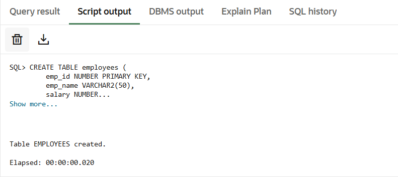
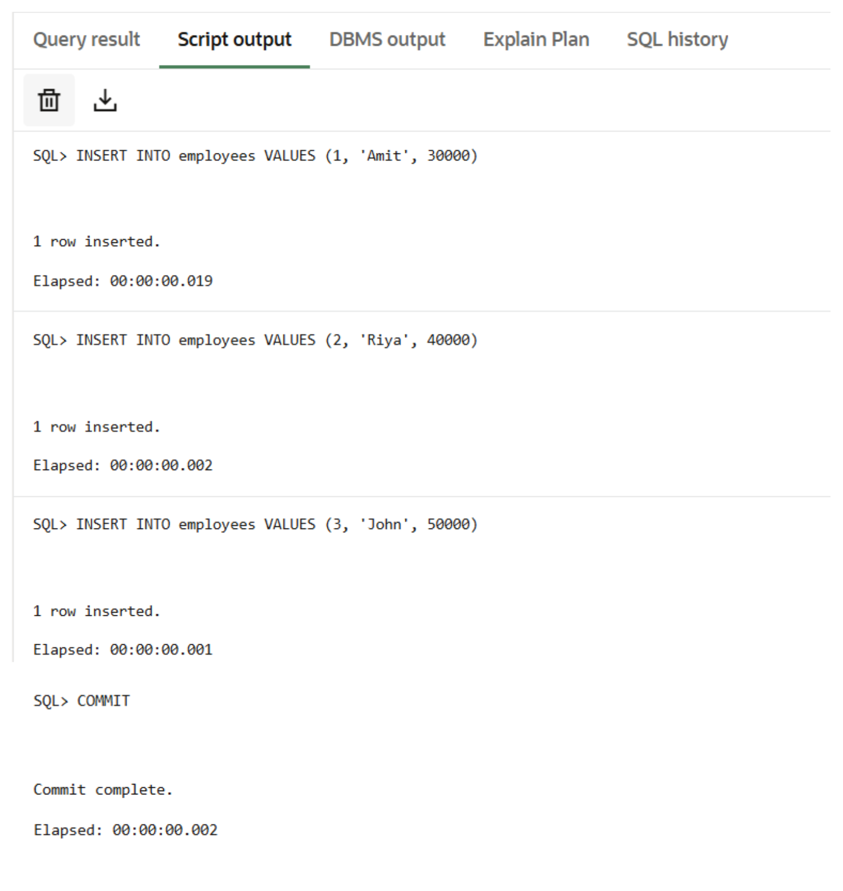
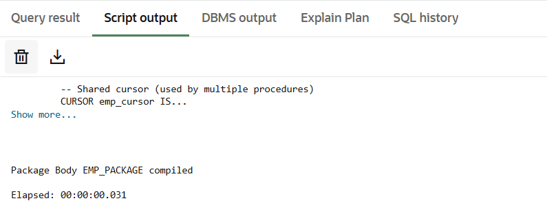

# Experiment 9

## Aim
To create and implement PL/SQL packages by developing a package specification and package body containing procedures and shared cursors, in order to achieve modular, reusable, and efficient database programming.

---

## Objectives
* To design and implement a PL/SQL package that includes procedures and shared cursors for structured and modular program development.

---

## Practical/Experiment Steps
* Modular Architecture Design: Structured the database logic into a two-part PL/SQL package consisting of a public specification and a private implementation body.
* Encapsulation of Global Assets: Defined a shared cursor within the package body to provide a centralized and reusable data source for multiple procedures.
* Procedural Logic Development: Authored specialized procedures to handle varied data retrieval tasks, including full table iteration and targeted record searching.
* Information Hiding Implementation: Enforced security and abstraction by hiding the internal cursor logic from the end-user while exposing only necessary procedure calls.
* Integration Testing: Executed the package subprograms within anonymous blocks to validate cross-procedure consistency and data accuracy.


---

## Procedure
1. Established a connection to the Oracle/PostgreSQL environment and enabled the output console for result verification.
2. Created the employees table and populated it with a baseline dataset to facilitate testing.
3. Drafted the Package Specification (emp_package AS) to declare the public interface of the procedures.
4. Constructed the Package Body (emp_package AS BODY) to house the shared emp_cursor and the actual logic for the declared procedures.
5. Implemented a FOR loop within show_employees to automatically handle the opening, fetching, and closing of the shared cursor.
6. Developed the logic for get_employee to filter the shared cursor data based on a user-provided input parameter.
7. Compiled both the specification and body to ensure there were no syntax errors or dependency issues.
8. Invoked emp_package.show_employees to test global data retrieval and printed the formatted output.
9. Called emp_package.get_employee(2) to verify the ability of the package to handle specific conditional requests using shared resources.


---

## I/O Analysis

**1. Input:**
```sql
CREATE TABLE employees (
    emp_id NUMBER PRIMARY KEY,
    emp_name VARCHAR2(50),
    salary NUMBER
);
```

**Output:**





**2. Input:**
```sql
INSERT INTO employees VALUES (1, 'Amit', 30000);
INSERT INTO employees VALUES (2, 'Riya', 40000);
INSERT INTO employees VALUES (3, 'John', 50000);

COMMIT;
```

**Output:**





**3. Input:**
```sql
CREATE OR REPLACE PACKAGE emp_package AS
    -- Procedure to display all employee details
    PROCEDURE show_employees;

    -- Procedure to display employee by ID
    PROCEDURE get_employee(p_id NUMBER);
END emp_package;
/
```

**Output:**


**4. Input:**
```sql
CREATE OR REPLACE PACKAGE BODY emp_package AS

    CURSOR emp_cursor IS
        SELECT emp_id, emp_name, salary FROM employees;

 
    PROCEDURE show_employees IS
    BEGIN
        FOR rec IN emp_cursor LOOP
            DBMS_OUTPUT.PUT_LINE('ID: ' || rec.emp_id ||
                                 ' Name: ' || rec.emp_name ||
                                 ' Salary: ' || rec.salary);
        END LOOP;
    END;

 
    PROCEDURE get_employee(p_id NUMBER) IS
    BEGIN
        FOR rec IN emp_cursor LOOP
            IF rec.emp_id = p_id THEN
                DBMS_OUTPUT.PUT_LINE('Employee Found -> ID: ' || rec.emp_id ||
                                     ' Name: ' || rec.emp_name ||
                                     ' Salary: ' || rec.salary);
            END IF;
        END LOOP;
    END;

END emp_package;
/
```

**Output:**





**5. Input:**
```sql
SET SERVEROUTPUT ON;


BEGIN
    emp_package.show_employees;
END;
/
CALL update_student(1, 'Rahul Verma', 22, 'Data Science');
```

**Output:**


**5. Input:**
```sql
BEGIN
    emp_package.get_employee(2);
END;
/
```

**Output:**


---

## Learning Outcomes
* Package Structure Proficiency: Gained a clear understanding of the separation between the package specification (header) and the package body (implementation).
* Modular Programming Mastery: Learned to group related database operations into a single logical unit to improve maintainability and code organization.
* Shared Resource Management: Expertise in utilizing shared cursors to reduce memory overhead and ensure consistent data fetching across multiple subprograms.
* Encapsulation and Security: Understood how packages provide a layer of abstraction by hiding complex implementation details from the calling environment.
